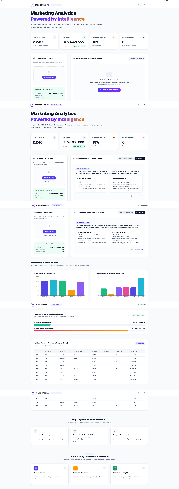

# 📊 MarketMind AI — Marketing Analytics Dashboard

MarketMind AI is a full-stack marketing analytics platform built with Next.js and TypeScript. It allows business teams to upload raw customer data via CSV, parse it efficiently, and transform complex metrics into actionable commercial marketing strategies.

🌐 **Live Demo**: [marketmind-ai-pi.vercel.app](https://marketmind-ai-pi.vercel.app)

---

## 📌 Key Features
* **CSV Data Processing**: Fast, client-side dataset parsing powered by `PapaParse`.
* **Automated Marketing Insights**: Transforms raw customer behavior metrics into clear visual dashboards.
* **Modern Web Architecture**: Built with Next.js App Router and TypeScript for scalable, high-performance web applications.

---

## 🖼️ Dashboard Preview


---

## 🛠️ Tech Stack & Tools
* **Framework**: Next.js (App Router)
* **Language**: TypeScript
* **Data Parsing**: PapaParse
* **Deployment**: Vercel
* **Styling**: PostCSS / Tailwind CSS

---

## 🚀 Local Development Setup

To run this project locally on your machine:

1. Clone the repository and install dependencies:
   ```bash
   npm install
Run the development server:

Bash
npm run dev
Open http://localhost:3000 in your browser.
